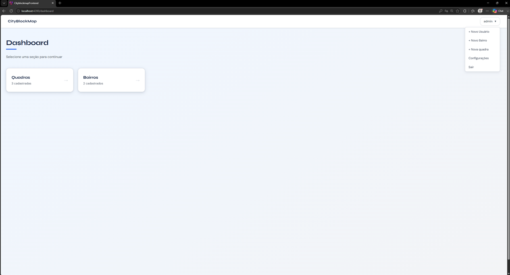
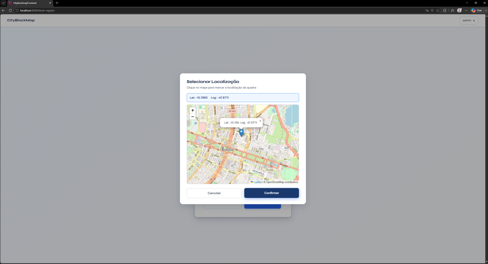
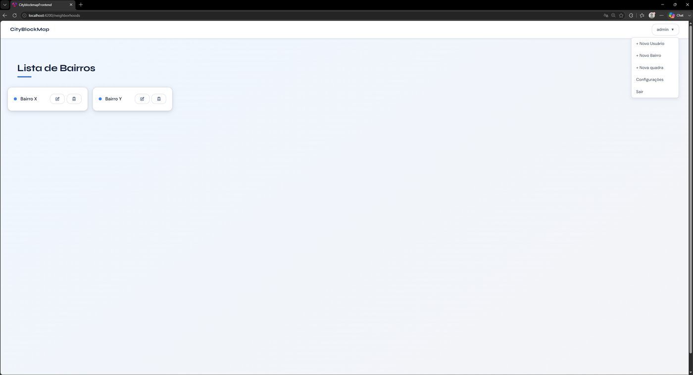
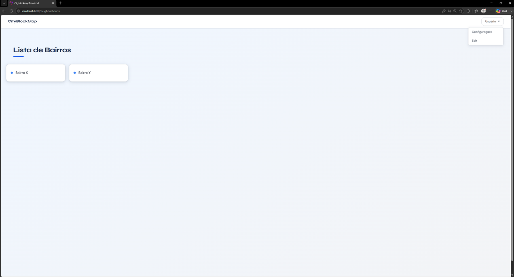
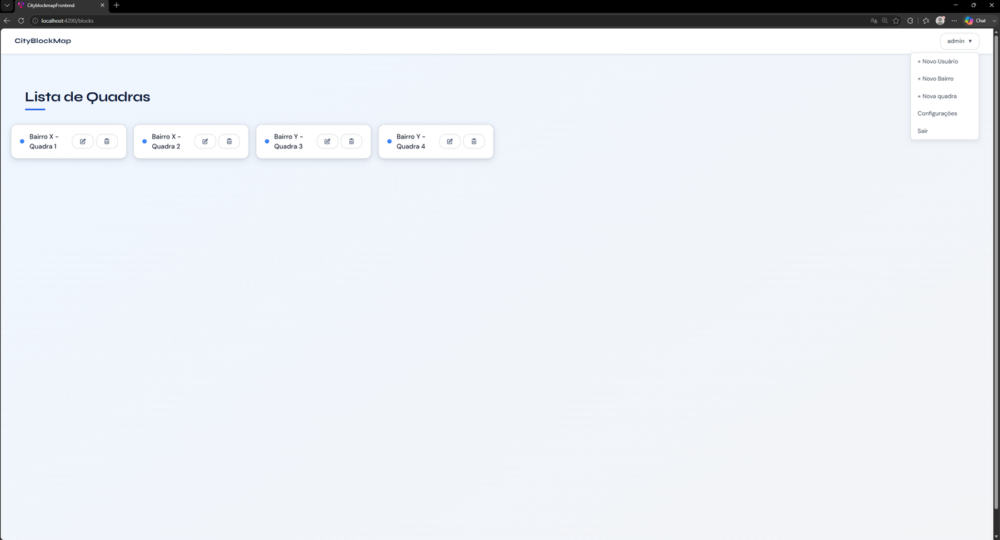
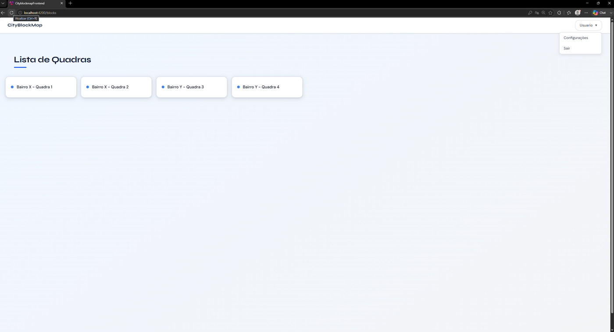
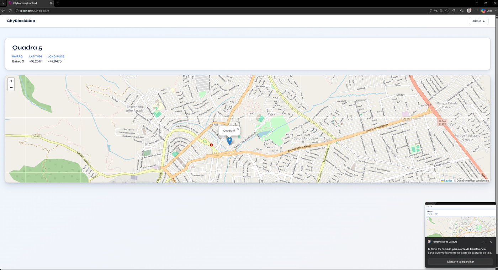

# CityBlockMap

Sistema web para mapeamento de quadras e bairros de uma cidade. Desenvolvido para facilitar a localização de quadras e bairros, sendo especialmente útil para empresas de prestação de serviço que precisam mapear e consultar quadras rapidamente.

---

## Screenshots

### Dashboard (visão do administrador)


O menu do administrador tem acesso completo: cadastro de usuários, bairros e quadras, além das configurações.

### Seleção de localização no mapa


Ao cadastrar uma quadra, é possível clicar diretamente no mapa para definir a latitude e longitude, em vez de digitar os valores manualmente.

### Lista de bairros e quadras
| Visão do administrador | Visão do usuário comum |
|---|---|
|  |  |
|  |  |

O usuário comum visualiza as mesmas listas, porém sem os botões de editar e excluir — esse controle de acesso é validado tanto no frontend quanto no backend.

### Detalhe de uma quadra no mapa


Cada quadra pode ser visualizada individualmente, com sua localização marcada no mapa via Leaflet.

---

## Funcionalidades

- Cadastro, edição e exclusão de quadras e bairros
- Visualização de quadras no mapa com marcação de coordenadas via Leaflet
- Seleção de localização diretamente no mapa ao cadastrar uma quadra
- Gerenciamento de usuários com perfis **ADMIN** e **USER**
- Autenticação via JWT com expiração automática de sessão
- Dashboard com contadores de quadras e bairros cadastrados
- Controle de acesso por perfil — apenas ADMINs podem cadastrar, editar e excluir

---

## Tecnologias

**Backend**
- Java 21
- Spring Boot 3.5
- Spring Security + JWT
- JPA / Hibernate
- PostgreSQL
- Flyway (migrations)
- Maven
- Docker

**Frontend**
- Angular 21
- TypeScript
- Leaflet
- Angular CDK

---

## Pré-requisitos

- [Docker](https://www.docker.com/) instalado
- Dois arquivos de configuração que **não foram para o repositório** por conterem dados sensíveis (veja a seção abaixo)

---

## ⚠️ Configuração obrigatória antes de rodar

O projeto precisa de **dois arquivos** que não são versionados no Git. Sem eles, o backend não inicializa.

### 1. Arquivo `.env` na raiz do projeto

Crie um arquivo chamado `.env` na raiz do repositório (mesma pasta do `docker-compose.yml`) com o seguinte conteúdo:

```env
JWT_SECRET=CRIE ALGUMA CHAVE JWT ALEATORIA AQUI

POSTGRES_USER=usuario do postgres
POSTGRES_PASSWORD=senha do postgres
POSTGRES_DB=cityblockmap

SPRING_DATASOURCE_URL=jdbc:postgresql://postgres:5432/cityblockmap
SPRING_DATASOURCE_USERNAME=usuario do postgres
SPRING_DATASOURCE_PASSWORD=senha do postgres

ADMIN_DEFAULT_PASSWORD=defina uma senha forte para o usuário admin
```

> `POSTGRES_USER` e `POSTGRES_PASSWORD` criam o usuário e senha do **banco de dados** na primeira vez que o container sobe.

> `DB_USERNAME` e `DB_PASSWORD` são as credenciais que o **backend Spring Boot** usa para se conectar ao banco. Devem ter os mesmos valores de `POSTGRES_USER` e `POSTGRES_PASSWORD`.

> `SPRING_DATASOURCE_URL` define a URL de conexão usada dentro do Docker. O nome `postgres` no meio da URL é o nome do serviço do banco de dados no `docker-compose.yml` — o Docker resolve automaticamente para o IP correto do container.

> `ADMIN_DEFAULT_PASSWORD` define a senha do usuário **admin** padrão da aplicação (não do banco de dados). A cada inicialização, o backend verifica se o admin existe e se sua senha ainda é a padrão original — se for, ele a substitui pelo valor definido aqui. Isso evita ter qualquer senha fixa no código-fonte.

## JWT_SECRET
O `JWT_SECRET` deve ser uma string longa e aleatória. Você pode gerar uma com:

```bash
powershell -Command "[System.Convert]::ToBase64String([System.Security.Cryptography.RandomNumberGenerator]::GetBytes(32))"
```

ou seguir o seguinte padrão:

```env
Z7uF2mL9QpX5wVr8NcB1sKd6TyJ4HgEaP0fRn3UvWxYzA8Cb
```

É importante que seja de 32 a 64 bytes gerados aleatoriamente por questões de segurança.

### 2. Arquivo `application-prod.properties` no backend

Crie o arquivo em `cityblockmap - Backend/src/main/resources/application-prod.properties`:

```properties
spring.datasource.url=jdbc:postgresql://localhost:5432/cityblockmap
spring.datasource.username=${DB_USERNAME:postgres}
spring.datasource.password=${DB_PASSWORD:postgres}
spring.datasource.driver-class-name=org.postgresql.Driver

spring.jpa.database-platform=org.hibernate.dialect.PostgreSQLDialect
spring.jpa.hibernate.ddl-auto=none
spring.jpa.show-sql=false
spring.jpa.properties.hibernate.format_sql=false

api.security.token.secret=${JWT_SECRET}

spring.flyway.enabled=true
spring.flyway.baseline-on-migrate=true
spring.flyway.locations=classpath:db/migration
```

> A `spring.datasource.url` deste arquivo usa `localhost` propositalmente como valor padrão, permitindo execução fora do Docker. Quando rodado via `docker-compose`, a variável `SPRING_DATASOURCE_URL` definida no `.env` **sobrescreve automaticamente** esse valor (variáveis de ambiente do sistema têm prioridade sobre o `.properties` no Spring Boot), apontando corretamente para o serviço `postgres` da rede Docker.

>`DB_USERNAME` ou `DB_PASSWORD` são o usuário e senha usados para conectar no banco de dados que foi definido no `.env`. Caso a variável de ambiente não exista, ele vai utilizar como usuário e senha a palavra `postgres`.

---

## Como rodar com Docker

Após criar os dois arquivos acima:

```bash
docker-compose up -d --build
```

Aguarde os containers subirem e acesse:

- **Frontend:** http://localhost
- **Backend:** http://localhost:8080

O banco de dados é criado automaticamente pelo Flyway na primeira execução.

---

## Primeiro acesso

Um usuário **admin** é criado/atualizado automaticamente na inicialização do backend, com login `admin` e a senha definida na variável `ADMIN_DEFAULT_PASSWORD` do seu `.env`.

> Nenhuma senha fica fixa no código-fonte ou nas migrations. Se você trocar a senha do admin diretamente pela aplicação, o backend deixa de sobrescrevê-la nas próximas inicializações — a sobrescrita só ocorre enquanto a senha estiver no valor padrão original.

---

## Como rodar em desenvolvimento local

**Backend:**
```bash
cd "cityblockmap - Backend"
mvn spring-boot:run
```

**Frontend:**
```bash
cd "cityblockmap - frontend"
npm install
ng serve
```

O perfil de desenvolvimento usa banco H2.

---

## Variáveis de ambiente

| Variável | Onde é usada | Descrição |
|---|---|---|
| `JWT_SECRET` | `.env` e `application-prod.properties` | Chave secreta para assinar os tokens JWT |
| `POSTGRES_USER` | `.env` | Usuário criado no banco de dados PostgreSQL |
| `POSTGRES_PASSWORD` | `.env` | Senha do usuário do PostgreSQL |
| `POSTGRES_DB` | `.env` | Nome do banco de dados |
| `SPRING_DATASOURCE_URL` | `.env` | URL de conexão usada pelo backend dentro do Docker |
| `DB_USERNAME` | `.env` | Usuário que o backend usa para conectar ao banco (mesmo valor de `POSTGRES_USER`) |
| `DB_PASSWORD` | `.env` | Senha que o backend usa para conectar ao banco (mesmo valor de `POSTGRES_PASSWORD`) |
| `ADMIN_DEFAULT_PASSWORD` | `.env` | Senha do usuário admin padrão da aplicação |

---

## Autor

**Luís Henrique De Oliveira Ruppenthal**
[GitHub](https://github.com/LuisRuppenthal/CityBlockMap)
